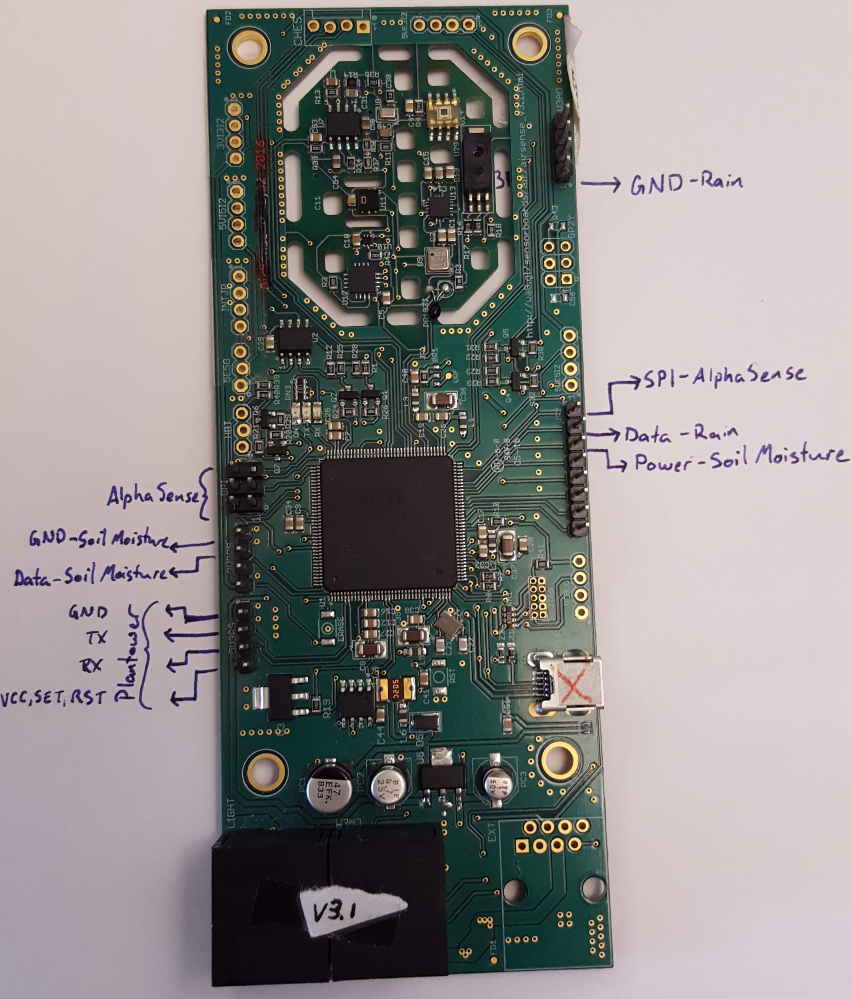
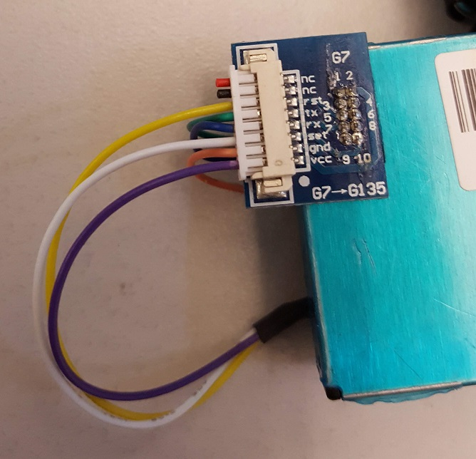
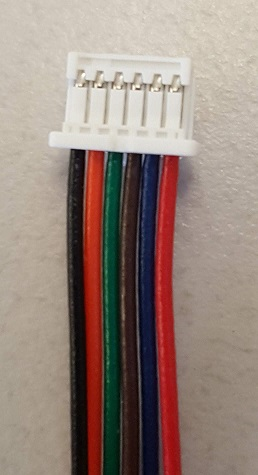
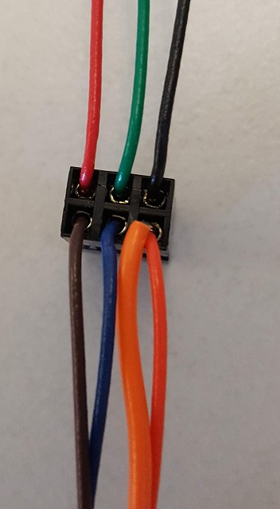
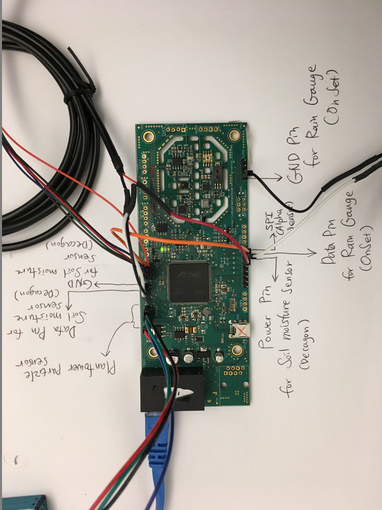

# MetSense external sensor integrations
Revised layout for additional sensor integrations, based on and incorporating work by Seongha Park. Incorporates:
* Decagon 5-TE soil moisture sensor
* TE-525-L rain gauge
* Plantower PMS7003 PM2.5 particle sensor
* Alphasense OPC-N2 particle sensor

## Board geography
Board orientation: Ethernet ports "down"

Pin groups:
* 4x right top (3V3AD)
* 7x right bottom (JP2)
* 6x left top (SPI; two rows of 3 with the top right pin cut off)
* 4x left middle (3V3RS)
* 4x left bottom (5V3RS)

Top pin in each group is 1

## Northwestern U. Sensor integrations:

### Rain gauge
Uses two-conductor barrel connector on board side (female)
* Data: White-stripe lead -> JP2 2
* GND: Solid black lead -> 3V3AD 4

### Soil moisture
Uses three-conductor stereo connector on board side (female)
* Power: Red lead -> JP2 3
* GND: Black lead -> 3V3RS 1
* Data: White lead -> 3V3RS 2

## Additional sensors:
There are currently two particle sensors in testing for integration with the MetSense board.

### Plantower PM2.5
Interfaces with the board via a G7 switch board and 8-conductor JST connector (only 6 conductors actually used)

On G7 swtich board, pins are oriented so that pin 1 is in the upper right-hand corner of the sensor with the "PLANTOWER" engraved text on the opposite side of the sensor and the open vent facing to the right.

Connections from switch board to MetSense:
* GND -> 5V3RS 1
* RX -> 5V3RS 3
* TX -> 5V3RS 2
* VCC, SET, RST -> 5V3RS 4

### AlphaSense Particulate sensor
Interfaces by a bundle of cables with a 2x3 rectangular dupont-style connector on one end and one-row 6-pin micro JST connector on the other.

JST connector with pins facing up, looking down the end that the wires enter:

Left - 1| 2 | 3 | 4 | 5 | Right - 6  
------------ | -------------  | -------------  | -------------  | -------------  | -------------  
Black | Orange | Green | Brown | Blue | Red

Dupont Connector, looking down the end that the wires enter:

Left - 1 | 2 | Right - 3
------------ | -------------  | ------------- 
Red | Green | Black  
Brown | Blue | Orange  

Connecting to the MetSense board, the orange wire goes in the corner with the cut-off pin. That slot in the connector has an additional orange wire connecting across the board to JP2 1

